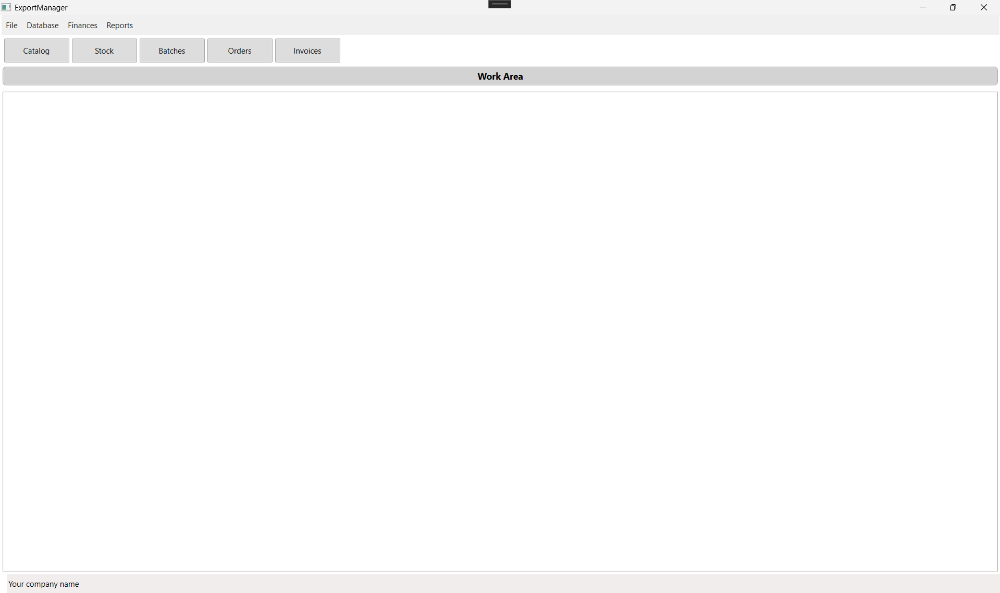
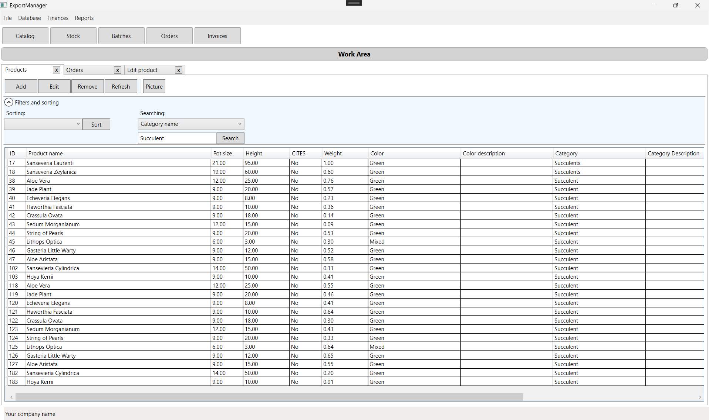
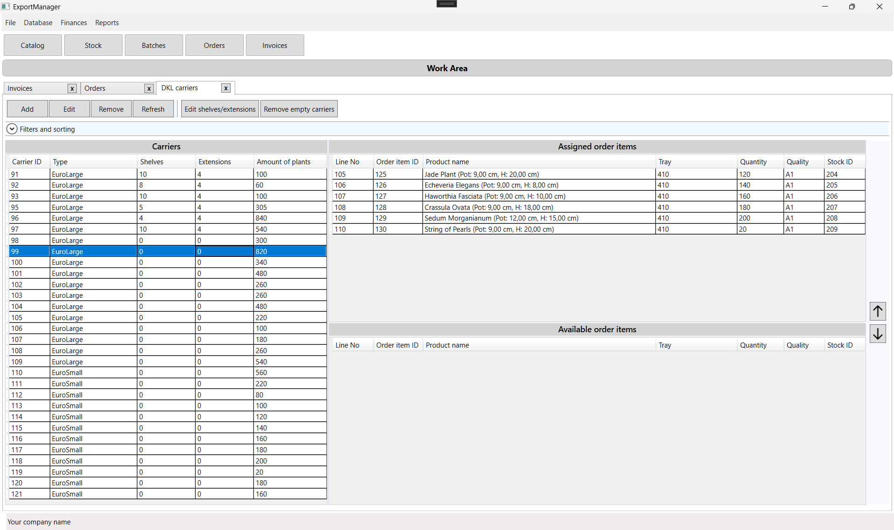
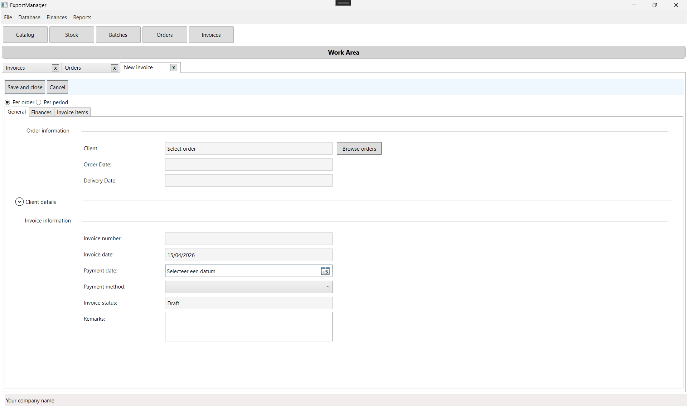
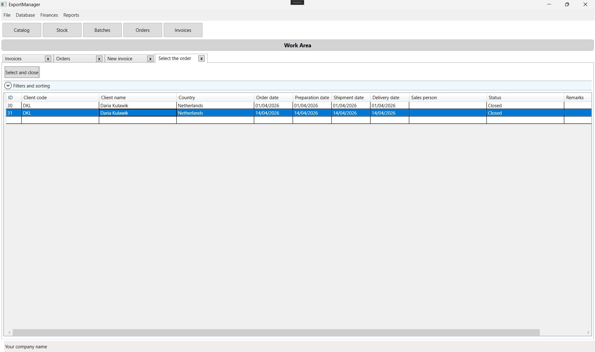
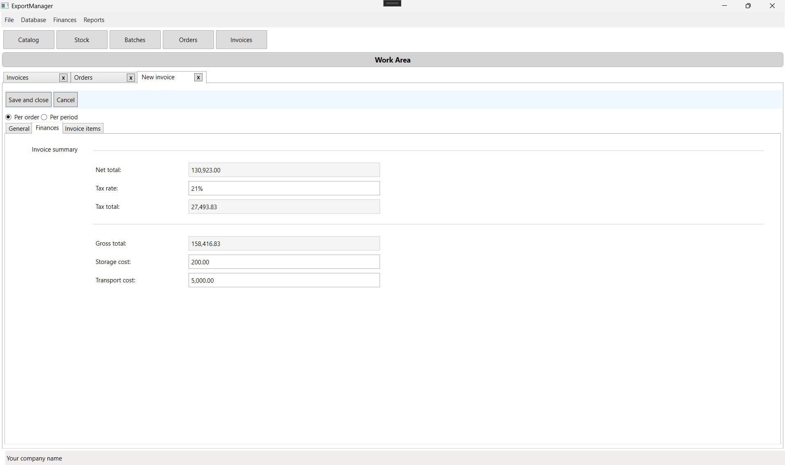
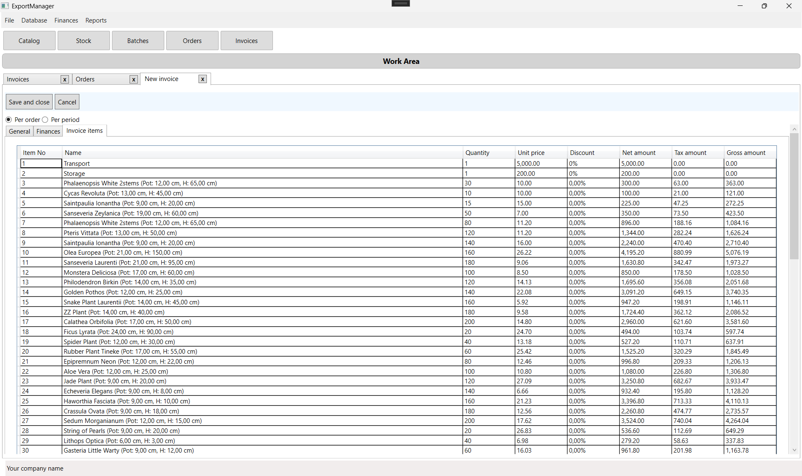
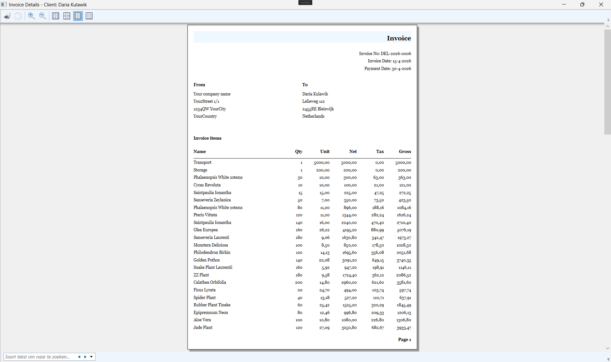
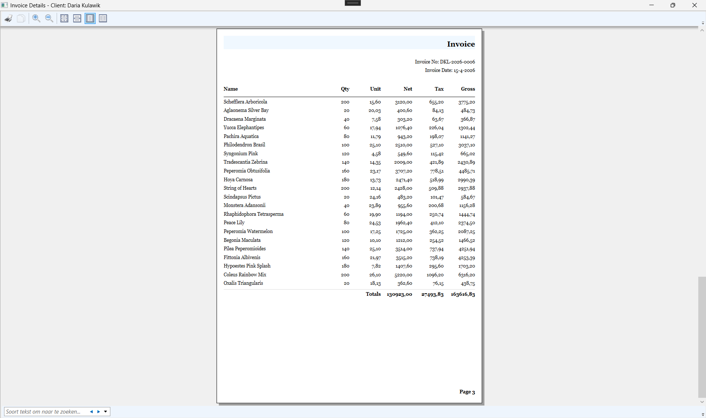

# ExportManager

Desktop business application for managing plant export operations.

## Overview

ExportManager is a WPF desktop application built with the MVVM pattern for handling day-to-day export workflow in a plant trading/logistics environment.

The application is focused on the operational side of the process:
- managing dictionary data
- maintaining product catalog and stock
- creating and processing orders
- assigning order items to carriers
- closing or cancelling orders
- creating, validating invoices
- generating reports and invoices

The main focus of this project was to model realistic business workflows and operational logic.

## Main Features

### Master data management
The application supports maintaining dictionary and reference data used across the system, including:
- carrier types
- categories
- colors
- countries
- cultivations
- payment methods
- quality types
- tray types
- clients
- growers
- addresses

### Product and stock management
- product catalog management
- stock overview
- batch management
- product image preview
- soft-delete handling for entities

### Order workflow
- create orders
- add and manage order items
- assign order items to carriers
- manage unassigned vs assigned order items
- validate business state before order closing
- cancel orders with stock restoration logic

### Invoice workflow
- create invoices
- validate/approve invoice-related flow
- print preview / report generation

### Reporting
- volume per client per period
- weight per order
- invoice summary

## Architecture

The application is built using:
- **WPF**
- **MVVM**
- **Entity Framework 6**
- **Database First (EDMX)**
- **.NET Framework 4.8**
- **Microsoft.Extensions.DependencyInjection**

### Project structure
- `ViewModels/ShowAllViewModels` – list and management screens
- `ViewModels/AddViewModels` – create/edit forms
- `ViewModels/ReportViewModels` – reporting and print-related view models
- `ViewModels/Windows` – modal/window-related view models
- `Services` – window handling abstractions and implementation
- `Models` – EF database model generated from EDMX, business logic classes, DTOs, validators, converters
- `Views` – WPF views
- `sqlscripts` – SQL scripts related to the project
- `Themes/Generic.xaml` – styles for parent views NewItemBase, ShowAllBase

### UI/navigation approach
The main window uses a workspace/tab-style approach where views are opened and managed through `MainWindowViewModel`. Modal windows are handled through a dedicated `WindowService`.

## Tech Stack

- C#
- WPF
- MVVM
- Entity Framework 6
- SQL Server
- EDMX / Database First
- Dependency Injection

## Notable Implementation Details

- workspace-based navigation in the main shell
- command-based UI interactions
- domain logic for closing and cancelling orders, invoices
- stock synchronization when order items are modified
- carrier assignment flow for order items
- reporting support for invoice, volume and order weight views

## Status

This project is an MVP / business prototype with substantial workflow coverage.
Some parts are more complete than others, but the main goal of the project was to model and implement a realistic export management process in a desktop application.

## Running the project

### Requirements
- Visual Studio 2022 or compatible version
- .NET Framework 4.8
- SQL Server database
- restored NuGet packages

### Setup
1. Clone the repository.
2. Restore NuGet packages.
3. Run the provided SQL sript in SSMS to create the database.
4. Configure the database connection in `App.config` in `<connectionStrings>` section (update `dataSource` to your SQLServer instance).
6. Build and run the WPF application.

## Screenshots

### Main Window

### Products

### Order items assignment

### Invoice workflow

### Generated document

## What I learned

While building this project, I worked on:
- modelling business workflows in code
- structuring a larger WPF application with MVVM
- working with relational data and EF6 database-first
- handling multi-step order and stock logic
- designing reusable list/detail management screens

## Repository Notes

This repository represents a learning project built around a real business domain.
The focus was on domain workflow, architecture and practical functionality rather than visual polish.

---
If you are reviewing this repository as a recruiter or developer, the best place to start is:
- `MainWindowViewModel`
- `ViewModels/ShowAllViewModels`
- `ViewModels/AddViewModels`
- `Services/WindowService`